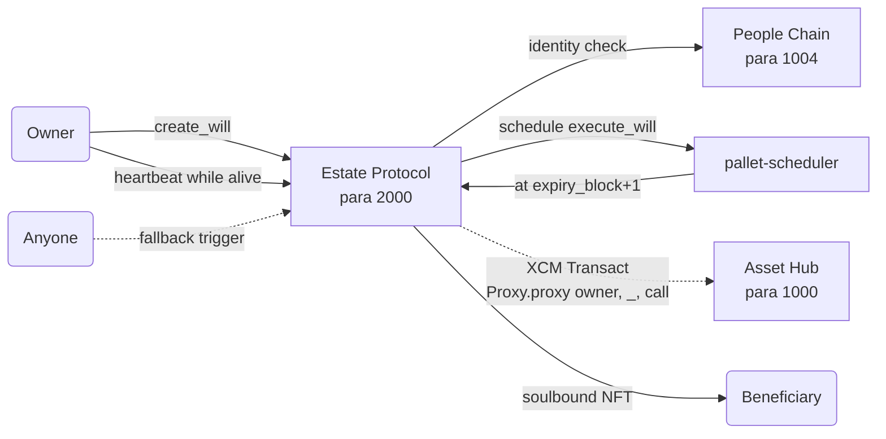

# Estate Protocol

A Polkadot SDK parachain for **digital legacy management**: register a *will* — a typed list of on-chain actions — that auto-executes on your behalf if you stop sending periodic heartbeats. Executions happen deterministically via `pallet-scheduler`; assets and proxies are moved on Asset Hub via XCM; beneficiaries receive a soulbound NFT receipt.

## What it does



- **Create** a will with one or more *bequests* — typed actions (`Transfer`, `TransferAll`, `Proxy`, `MultisigProxy`) whose recipients are checked against `pallet-identity` on People Chain at create time.
- **Heartbeat** periodically to reset the expiry. Tx-payment is feeless for the owner; a separate **longevity fee** scales with `block_interval`.
- If you stop heartbeating, the scheduler fires `execute_will` at `expiry_block + 1`. If the scheduler is late, anyone can call `trigger(id)` to fire the will manually and earn a bounded reward from the collected execution fee.
- Each bequest translates into an XCM message dispatched as the owner on Asset Hub (via a pre-granted `ProxyType::Any` proxy link).
- One **soulbound inheritance certificate** NFT is minted per unique beneficiary.

## Fee model

Three surfaces, all routed through a runtime `FeeRouter` that splits **30 % burn / 70 % to the Estate treasury** (a `PalletId`-derived sovereign account):

| Fee | Charged when | Amount |
|---|---|---|
| Longevity | `create_will` + every `heartbeat` | `block_interval * FeePerBlock` |
| Execution | Reserved at `create_will`, slashed at execute | `ProtocolFeePermill * amount` (Transfer) or `FlatBequestFee` (others) |
| Trigger reward | Paid to caller of `trigger` | `min(per_block * overdue_blocks, cap, collected_fee)` |

No new protocol token — everything is in the native chain token. The trigger reward is flat-capped so it cannot scale with will size, which is what made the original keeper design a coercion target.

## Layout

| Path | What it contains |
| --- | --- |
| [`blockchain/pallets/estate-executor/`](blockchain/pallets/estate-executor/) | The Estate Executor FRAME pallet (storage, calls, fee helpers, scheduler wiring) |
| [`blockchain/runtime/`](blockchain/runtime/) | The parachain runtime (`estate-protocol-runtime`) — wires `pallet-nfts`, `pallet-identity` stub, XCM, `SplitTwoWays` fee router |
| [`web/`](web/) | React + `polkadot-api` frontend: create wills, heartbeat, see certificates, link Asset Hub |
| [`scripts/`](scripts/) | Local dev (solo node + zombienet), end-to-end test suite |
| [`contracts/evm/`](contracts/evm/) | Optional EVM contract examples (pallet-revive) |

## Quick start

```bash
# Full topology: relay + Estate + Asset Hub + People Chain
./scripts/start-zombienet.sh

# Frontend
./scripts/start-frontend.sh

# End-to-end test suite
./scripts/test-zombienet.sh

# Pallet unit tests (no network needed)
cargo test -p pallet-estate-executor
```

See [`scripts/README.md`](scripts/README.md) for the full infra and test flow, [`blockchain/pallets/estate-executor/README.md`](blockchain/pallets/estate-executor/README.md) for the pallet reference, and [`web/README.md`](web/README.md) for the page-by-page UI guide.
