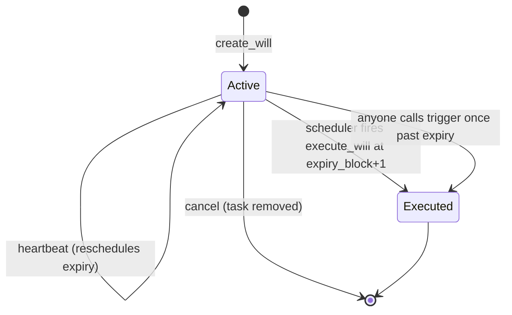
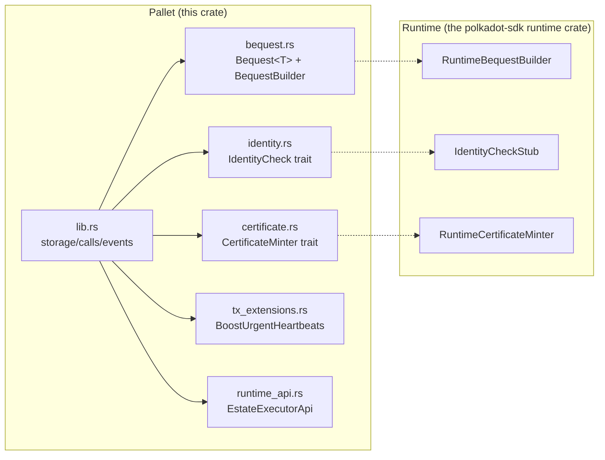

# Estate Executor Pallet

Core executor pallet of the **Estate Protocol**. Users register a "will" — a list of typed **bequests** — that auto-executes if the owner stops sending periodic heartbeats. Each bequest translates at execution time to the appropriate `RuntimeCall` and is dispatched as `Signed(owner)` on a best-effort basis.

Execution is driven by `pallet-scheduler`: creating a will schedules its auto-execution at `expiry_block + 1`; heartbeats reschedule; cancel removes the scheduled task.

## Lifecycle



Typical flow:

1. **Owner** registers a will with a list of bequests and a heartbeat interval.
2. The pallet schedules an `execute_will(id)` task via `pallet-scheduler` at `expiry_block + 1`.
3. Owner sends **heartbeats** before the expiry block to push the scheduled execution forward.
4. If the owner stops, the scheduler fires `execute_will` at the scheduled block.
5. If the scheduler is late (congested agenda), **any** signed account can call `trigger(id)` after `expiry_block` and earn a bounded reward out of the collected execution fee.
6. On execution each bequest is translated into a `RuntimeCall` via `BequestBuilder` and dispatched as `Signed(owner)` — best-effort, independent success/failure per bequest.
7. A soulbound inheritance certificate NFT is minted, once per unique beneficiary, via `CertificateMinter`.
8. Owner can **cancel** an active will at any time; the scheduled task is removed, reserved execution fees are refunded.

## Module Layout



The pallet never hard-codes Balances, Proxy, NFTs or Identity. All of those live behind traits the **runtime** implements, which keeps the pallet portable across runtimes with different pallet layouts.

## Dispatchables

| Call | Description |
|---|---|
| `create_will(bequests, block_interval)` | Validate bequest shapes + beneficiary identities, charge longevity fee, reserve execution fee, register the will, schedule auto-execution at `current_block + block_interval + 1`. |
| `heartbeat(id)` | Owner resets expiry and reschedules the task. Must be called no later than `expiry_block`. Tx-payment **feeless** when called by the owner of an active will; a longevity fee is still charged separately. |
| `execute_will(id)` | Internal — `Root`-only. The scheduler calls this at the scheduled block. Each bequest becomes a `RuntimeCall` and is dispatched as `Signed(owner)`; certificates are minted per unique beneficiary; execution fee is routed through `FeeRouter`. |
| `trigger(id)` | **Any** signed account can call once `now > expiry_block`. Same execute path as `execute_will`, plus a reward is split off from the execution fee for the caller (capped by `TriggerRewardCap` and by the collected fee). |
| `cancel(id)` | Owner cancels the will; the scheduled task is removed. Execution-fee reserve is refunded; longevity fee is not. |

`execute_will` accepts `Root` origin so governance or sudo can also force-execute — scheduler dispatches use `RawOrigin::Root`. `trigger` is the permissionless fallback with a bounded bounty.

## Bequests

### Typed enum, not stored calls

An earlier design stored arbitrary SCALE-encoded `RuntimeCall`s paired with a separate `beneficiaries` list. That created two sources of truth that could drift out of sync. The current design uses a typed `Bequest<T>` enum with recipients **inside** each variant:

```rust
pub enum Bequest<T: Config> {
    Transfer { dest, amount },
    TransferAll { dest },
    Proxy { delegate },
    MultisigProxy { delegates, threshold },
}
```

`Pallet::beneficiaries_of(will_id)` derives the beneficiary set structurally by iterating bequests and unioning their `recipients()`. Inconsistency is impossible by construction.

### Variants

| Variant | Recipients | Effect |
|---|---|---|
| `Transfer { dest, amount }` | `[dest]` | Transfers `amount` to `dest` (on Asset Hub via XCM in this runtime). |
| `TransferAll { dest }` | `[dest]` | Transfers the owner's entire free balance to `dest`. |
| `Proxy { delegate }` | `[delegate]` | Grants `delegate` unrestricted proxy access to the owner's account. |
| `MultisigProxy { delegates, threshold }` | `delegates` | Derives the standard multisig account id from `(delegates, threshold)` and grants it unrestricted proxy access. |

### `BequestBuilder` — the runtime adapter

The pallet stays agnostic of which pallets supply Balances/Proxy. The runtime provides a `BequestBuilder` impl that translates each variant into the concrete `RuntimeCall` at execution time. In this runtime the builder constructs an XCM `Transact` wrapped in `Proxy.proxy(owner, _, call)` and sends it via `pallet_xcm::send_xcm(Here, AssetHub, ...)` — the parachain sovereign dispatches the inner call as the owner on Asset Hub.

## Errors

| Error | Raised by | Condition |
|---|---|---|
| `InvalidInterval` | `create_will` | `block_interval == 0` |
| `NoBequests` | `create_will` | `bequests.is_empty()` |
| `TooManyBequests` | `create_will` | `bequests.len() > MaxBequests` (cap check runs **before** per-bequest validation) |
| `BlockIntervalTooLarge` | `create_will` / `heartbeat` / `trigger` | Adding `block_interval` to current block overflows |
| `ZeroTransferAmount` | `create_will` | `Transfer { amount: 0 }` |
| `TooFewDelegates` | `create_will` | `MultisigProxy { delegates.len() < 2 }` |
| `InvalidThreshold` | `create_will` | `MultisigProxy` with enough delegates but threshold `== 0` or `> delegates.len()` |
| `BeneficiaryNotVerified` | `create_will` | A recipient has no identity entry that passes `IdentityCheck::is_verified` |
| `InsufficientFeeBalance` | `create_will` / `heartbeat` | Owner cannot cover longevity fee or execution-fee reserve |
| `NotOwner` | `heartbeat` / `cancel` | Caller is not the will owner |
| `WillNotFound` | all | No will with that id |
| `WillNotActive` | `heartbeat` / `cancel` | Will is not in `Active` status (e.g. already executed) |
| `WillExpired` | `heartbeat` | Called after `expiry_block` |
| `TooEarlyToTrigger` | `trigger` | Called before `now > expiry_block` |
| `AlreadyExecuted` | `execute_will` / `trigger` | Will is already in `Executed` state |
| `ScheduleFailed` | `create_will` / `heartbeat` | `pallet-scheduler` refused to accept the task |

## Fee Model

Three revenue surfaces; all routed through `T::FeeRouter`. Runtime wires a `SplitTwoWays<_, _, (), EstateTreasuryDeposit, 30, 70>` — 30% burn, 70% to a `PalletId`-derived treasury account.

| Fee | Paid by | When | Amount |
|---|---|---|---|
| **Longevity fee** | Owner | At `create_will` **and** every `heartbeat` | `block_interval * FeePerBlock` — scales linearly with scheduler runway held open. Not refunded on cancel. |
| **Execution fee** | Owner | Reserved at `create_will`, settled at execute time | `Transfer` → `ProtocolFeePermill * amount`. Other variants → `FlatBequestFee`. Refunded on cancel; slashed + routed through `FeeRouter` at execute. |
| **Trigger reward** | — (paid **out of** the execution fee) | At `trigger` | `min(TriggerRewardPerBlock * blocks_overdue, TriggerRewardCap, total_fee)` — linearly grows until capped, never exceeds what the owner paid in. |

### Why a manual `trigger` with a reward doesn't reintroduce the coercion attack

The original design paid a random reward to anyone who fired a will at expiry, which turned high-value wills into coercion targets (attackers could profit by keeping the owner offline). This implementation differs in three ways:

1. **The scheduler still fires deterministically at `expiry_block + 1`** without any caller — the trigger is a fallback, not the primary path.
2. **The reward is capped** (`TriggerRewardCap`, set in the runtime to `ESTATE_FLAT_BEQUEST_FEE`). A 1M-ROC will and a 1-ROC will pay the same max reward, so there is no incentive to target large wills.
3. **The reward is bounded by the collected fee**. We never pay out more than the owner paid in — impossible to drain the treasury.

## Custom Transaction Extensions

| Extension | Purpose |
|---|---|
| `BoostUrgentHeartbeats` | Hand-written `TransactionExtension`. Promotes heartbeats whose target will expires within `URGENCY_WINDOW` (10) blocks to `u64::MAX` tx-pool priority. Defends against pool congestion attacks aimed at delaying a heartbeat past expiry. |

The runtime additionally uses `pallet-skip-feeless-payment` to make owner-heartbeats feeless via the pallet's `#[pallet::feeless_if]` predicate.

## Storage

| Item | Description |
|---|---|
| `Wills` | Will metadata: owner, bequest count, interval, expiry block, status, executed block |
| `WillBequests` | Typed bequests per will |
| `NextWillId` | Auto-incrementing ID counter |
| `CertificateCollectionId` | Lazily-initialised NFT collection id used for soulbound inheritance certificates |

Scheduled tasks live in `pallet-scheduler`'s own storage under a deterministic task name (`blake2_256("estate_executor", id)`).

## Runtime API

| Method | Description |
|---|---|
| `EstateExecutorApi::inheritances_of(account)` | IDs of all currently active wills naming `account` as a recipient of at least one bequest. Iterated runtime-side so the frontend can answer "what would I inherit?" without bulk-downloading state. |

## Config

| Type | Description |
|---|---|
| `Balance` | Balance type used in `Bequest::Transfer`. |
| `RuntimeCall` | Overarching call type; must include our own `Call<Self>` so `execute_will` can be scheduled. |
| `PalletsOrigin` | Origin aggregation passed to the scheduler. |
| `Scheduler` | Implements `schedule::v3::Named`. |
| `BequestBuilder` | Translator from `Bequest<Self>` to `RuntimeCall`. |
| `IdentityCheck` | Runtime-side identity verification hook. |
| `CertificateMinter` | Runtime-side soulbound NFT minter. |
| `MaxBequests` | Maximum bequests per will (runtime: 5). |
| `Currency` | `ReservableCurrency` used to charge fees. Runtime: `pallet-balances`. |
| `FeeRouter` | `OnUnbalanced` sink for collected fees. Runtime: `SplitTwoWays` (30 burn / 70 treasury). |
| `FeePerBlock` | Per-block longevity fee rate. |
| `ProtocolFeePermill` | Percentage skim applied to each `Transfer` bequest amount. |
| `FlatBequestFee` | Flat execution fee for bequests with no known amount at create time. |
| `TriggerRewardPerBlock` | Reward growth rate for the `trigger` caller, per block overdue. |
| `TriggerRewardCap` | Absolute cap on the trigger reward (runtime: `FlatBequestFee`). |

## Threat Model & Open Questions

- **Scheduler Agenda is public**: anyone can read the target block of a scheduled will. A determined attacker can attempt to saturate that block to push the task into overweight and delay it. Mitigation today is the scheduler's automatic retry-on-overweight plus `BoostUrgentHeartbeats` for the heartbeat side. Prolonged delays require the attacker to saturate consecutive blocks, which scales poorly due to block fees.
- **Priority is cooperative**: `BoostUrgentHeartbeats` raises pool priority but priority is enforced by the node software, not by consensus — a malicious collator can ignore it. Real protection requires collator-set decentralisation.
- **Future hardening**: off-chain worker-driven execution (no public target block) is planned for a later phase, together with reminder and death-verification oracle integration.

## Source Layout

| File | Purpose |
|---|---|
| `src/lib.rs` | Pallet storage, config, calls, events, errors |
| `src/bequest.rs` | `Bequest<T>` enum + `BequestBuilder` trait |
| `src/identity.rs` | `IdentityCheck` trait (runtime-provided) |
| `src/certificate.rs` | `CertificateMinter` trait (runtime-provided) |
| `src/tx_extensions.rs` | `BoostUrgentHeartbeats` transaction extension |
| `src/runtime_api.rs` | `EstateExecutorApi` runtime API declaration |
| `src/weights.rs` | Placeholder weight functions |
| `src/benchmarking.rs` | Benchmark definitions for all dispatchables |
| `src/mock.rs` | Mock runtime with balances, proxy, multisig, scheduler |
| `src/tests.rs` | Tests covering calls, permissions, validation, proxy, multisig, inheritances |

## Commands

```bash
# Check compilation
cargo check -p pallet-estate-executor

# Run unit tests
cargo test -p pallet-estate-executor

# Run benchmarks
cargo test -p pallet-estate-executor --features runtime-benchmarks
```
