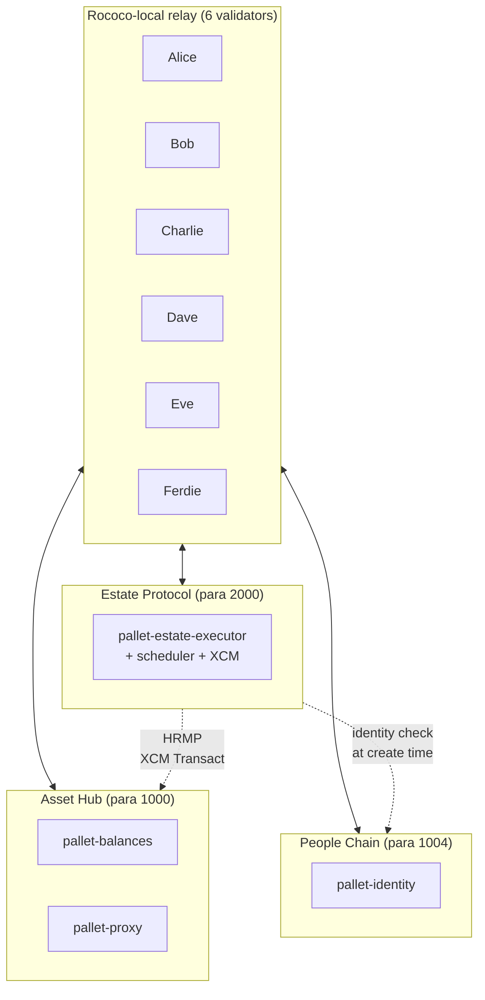
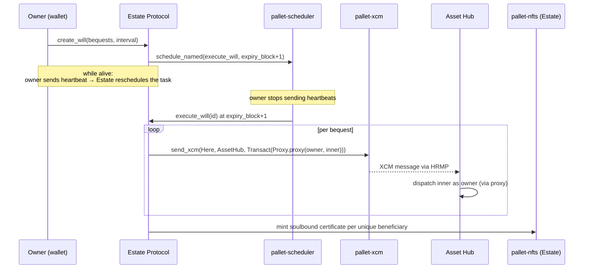
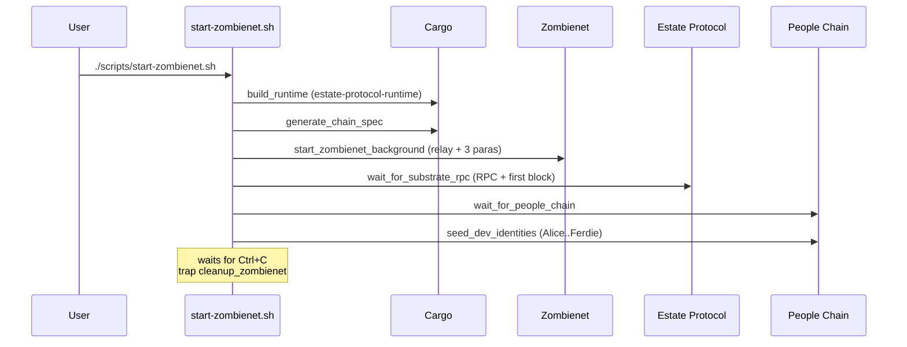
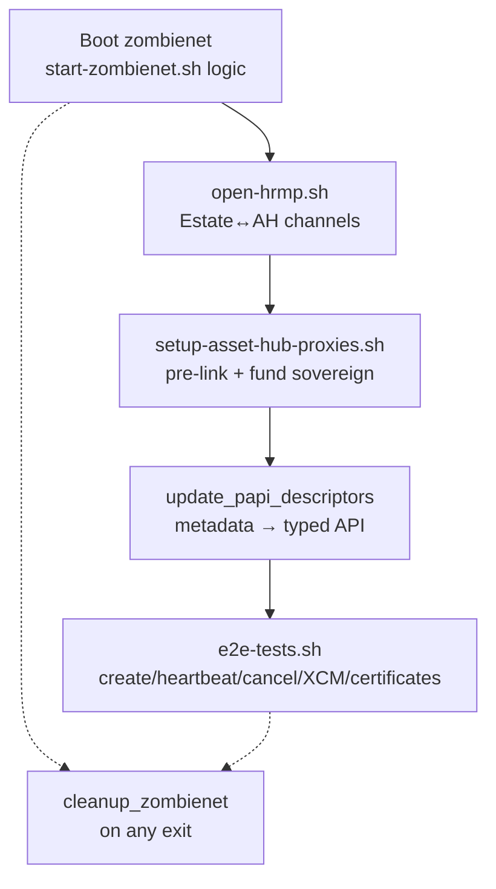

# Scripts

Bash helpers that build, boot, seed and test the full Estate Protocol stack locally. All scripts source `common.sh` for shared helpers (port config, readiness probes, zombienet config generation, cleanup).

```bash
./scripts/<script-name>.sh
```

## Topologies

Two supported local topologies, picked per workflow:

| Mode | Script | Relay | Para 2000 (Estate) | Para 1000 (Asset Hub) | Para 1004 (People) | XCM | Identity |
|---|---|---|---|---|---|---|---|
| **Solo dev** | `start-dev.sh` | — | omni-node | — | — | — | — |
| **Zombienet** | `start-zombienet.sh` | rococo-local (6 validators) | ✓ | ✓ | ✓ | ✓ | ✓ |

Solo dev is the fastest pallet/runtime loop — ~2 min first boot, under 10s after. Zombienet is required for anything that crosses chains (proxy linking, remote transfers, identity checks).

## Zombienet Network



HRMP channels Estate↔AH are opened via sudo by `open-hrmp.sh` right after the relay is up. Each parachain's sovereign account on AH is funded by `setup-asset-hub-proxies.sh` so XCM execution fees are payable.

## End-to-End Flow

A will with an XCM bequest goes through three layers:



The inner call depends on the bequest variant:

- `Transfer` → `Balances.transfer_keep_alive(dest, amount)`
- `TransferAll` → `Balances.transfer_all(dest, keep_alive=false)`
- `Proxy` → `Proxy.add_proxy(delegate, Any, 0)`
- `MultisigProxy` → `Proxy.add_proxy(multisig_account_of(delegates, threshold), Any, 0)`

All wrapped in `Proxy.proxy(owner, None, inner)` so Asset Hub dispatches as `owner` rather than as the Estate sovereign. Requires the owner to have pre-granted `ProxyType::Any` to the Estate sovereign on Asset Hub — the "Link Asset Hub" flow in the frontend.

## Script Guide

| Script | What it does |
| --- | --- |
| `start-dev.sh` | Builds the runtime, generates chain spec, starts a solo omni-node on `ws://127.0.0.1:9944`. Fastest loop; no XCM or identity support. |
| `start-zombienet.sh` | Builds runtime, generates chain spec, spawns the full relay + 3-parachain topology, seeds dev identities. Foreground process with cleanup on `Ctrl+C`. |
| `start-frontend.sh` | Installs web deps, regenerates PAPI descriptors against the running node, starts Vite on `http://127.0.0.1:5173`. |
| `test-zombienet.sh` | CI-style end-to-end: starts zombienet, runs `open-hrmp.sh` + `setup-asset-hub-proxies.sh`, then executes `e2e-tests.sh` against the live stack. Auto-cleanup on exit. |
| `e2e-tests.sh` | The actual test suite (expects a running network). Verifies create / heartbeat / cancel, XCM-to-AH dispatch for Transfer and Proxy bequests, and certificate minting. XCM tests auto-skip when Asset Hub is unreachable. |
| `open-hrmp.sh` | Opens HRMP channels Estate↔AH via sudo. Needed before any XCM exchange. |
| `setup-asset-hub-proxies.sh` | Pre-links Alice and Bob on Asset Hub (grants `ProxyType::Any` to Estate sovereign), funds the Estate sovereign on AH so it can pay XCM fees. |
| `seed-identities.sh` | Registers `pallet-identity` entries for dev accounts (Alice…Ferdie) on People Chain. Invoked automatically by `start-zombienet.sh`. |

## Boot Sequence — `start-zombienet.sh`



## Test Flow — `test-zombienet.sh`



`test-zombienet.sh` traps `EXIT|INT|TERM` to guarantee zombienet is torn down even on failure.

## Requirements

- `cargo`, `chain-spec-builder`, `polkadot-omni-node` — for `start-dev.sh`
- `zombienet`, `polkadot`, `polkadot-parachain`, `polkadot-omni-node` — for `start-zombienet.sh`
- `node` (v22) and `npm` — for `start-frontend.sh`, `test-zombienet.sh`, `e2e-tests.sh`
- `curl`, `lsof` — used by readiness probes and port checks

See `common.sh::install_hint` for per-command installation pointers. Binary versions are tracked against the `polkadot-stable2512-3` release of `polkadot-sdk`.

## Port Layout

All ports can be offset uniformly with `STACK_PORT_OFFSET=N` to run multiple stacks side-by-side, or overridden individually via `STACK_*_PORT` env vars.

| Service | Default |
|---|---|
| Estate Protocol RPC (ws) | 9944 |
| People Chain RPC (ws) | 9946 |
| Asset Hub RPC (ws) | 9948 |
| Relay validators (Alice…Ferdie) | 9949, 9951, 9953, 9955, 9957, 9959 |
| Frontend (Vite) | 5173 |
