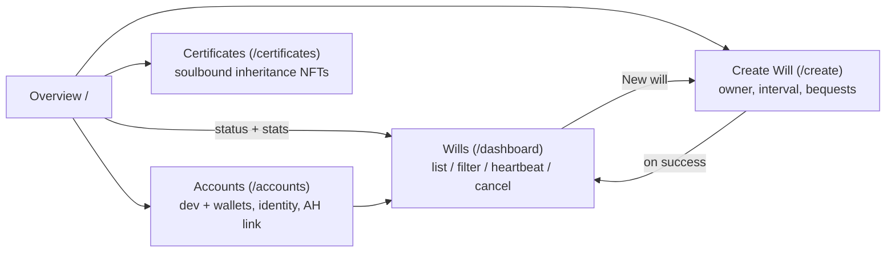

# Estate Protocol — Web UI

React + Vite + TypeScript frontend for the Estate Protocol parachain. Cyberpunk terminal aesthetic; connects to the Estate Protocol node directly and to the sibling Asset Hub + People Chain for identity checks and XCM-dispatched bequests.

## Stack

- **React 18** + **Vite** + **TypeScript** + **Tailwind** (custom cyberpunk theme in `src/index.css`)
- **[PAPI](https://papi.how/)** (polkadot-api) for chain interactions — typed queries, transaction submission, subscriptions
- **[Zustand](https://github.com/pmndrs/zustand)** for cross-page state (chain connection, selected account, toast queue)
- **React Router** hash-routed (IPFS gateways serve `index.html` from the root)

## Page Map



## Pages

### Overview — `/`

Landing page. Shows a hero explaining the protocol, global counters (active / executed / expired wills) fetched from `EstateExecutor.Wills`, and links into the feature pages. Purely read-only.

### Wills — `/dashboard`

The vault. Lists every will on chain with its status chip (Active / Expired / Executed), a live countdown (seconds + blocks to expiry), and the "names you" / "yours" chips derived client-side by comparing `bequest.recipients()` against the selected account.

Filters: **Everything / Yours / Names you / Expired / Executed**. Each row expands to show the bequest list, owner, expiry block, and actions:

- **Heartbeat** — owner-only, hidden once the will expires.
- **Cancel** — owner-only; opens a confirmation modal (destructive, irreversible).
- **Trigger** — shown on expired rows to any connected account. Fires the pallet's `trigger(id)` fallback when the scheduler is late; the caller earns a bounded reward out of the collected execution fee.

Toasts report tx outcomes; rows refresh on every new best block.

### Create Will — `/create`

Three steps:

1. **Sign as** — pick the owner account from dev accounts + connected wallet accounts. Shows the account's Asset Hub balance and whether it's linked (proxy granted to the Estate sovereign).
2. **Heartbeat interval** — duration + unit picker (s/min/h/d/w/mo/y). Preview shows the equivalent in blocks using the measured `blockTime`.
3. **Instructions** — one or more bequests. Each entry picks a pattern (Transfer / Transfer all / Proxy / Multisig proxy) and fills in recipients + amounts. Beneficiaries are checked in real time against People Chain `pallet-identity`; invalid addresses, zero amounts, and out-of-bounds multisig thresholds block the submit button (mirrors the on-chain `ZeroTransferAmount` / `InvalidThreshold` / `TooFewDelegates` guards).

The review block at the bottom shows two protocol fees that will be charged: **Longevity fee** (`block_interval * FeePerBlock`, recomputes live with the interval slider) and **Execution fee at run** (sum of `ProtocolFeePermill * amount` per Transfer + `FlatBequestFee` per proxy/transfer-all bequest, reserved at create and slashed when the will executes). Constants mirror `blockchain/runtime/src/configs/mod.rs` via `src/config/fees.ts`.

Submit signs `EstateExecutor.create_will` with the selected account, toasts the block number, and navigates to the dashboard.

### Accounts — `/accounts`

Manages signing identities used by the rest of the app:

- **Dev accounts** (Alice…Ferdie) — always shown, pre-funded in dev.
- **Browser wallets** — `polkadot-api/pjs-signer` with support for Polkadot.js, SubWallet, Talisman.

For each account: Asset Hub balance (hero number), Estate balance + nonce, **Identity** (register / display / clear on People Chain), **Asset Hub link** (grant / revoke proxy to the Estate sovereign). Dismissible pills represent the linked/registered state; clicking the × revokes.

### Certificates — `/certificates`

Read-only view of inheritance certificate NFTs the selected account holds. Each card shows the will id it came from, which bequests benefited the holder, the executed block, and a link back to the originating owner.

## Runtime Context

`App.tsx` owns:

- **Chain connection** — `useConnection` + `useConnectionManagement` drive a single PAPI client instance, tracking best blocks to compute `blockTime` and block number. The chain-offline banner shows once the initial connect attempt completes without success.
- **Toasts** — global store, 5s auto-dismiss, stacked top-right.
- **Navigation** — header with terminal-styled tabs; connection status button in the top-right opens a dialer panel for switching nodes.

## Endpoints

| Var | Default | Purpose |
|---|---|---|
| `VITE_LOCAL_WS_URL` | `ws://localhost:9944` | Estate Protocol node when on localhost |
| `VITE_WS_URL` | — | Override when deployed (non-localhost) |
| `VITE_PEOPLE_CHAIN_WS_URL` | `ws://localhost:9946` | People Chain (identity) |
| `VITE_ASSET_HUB_WS_URL` | `ws://localhost:9948` | Asset Hub (balances + proxy) |

`getStoredWsUrl()` persists the user's last choice in `localStorage` under `ws-url`, auto-migrating when the default changes between builds.

## Local Development

```bash
# From repo root, script-driven (handles PAPI descriptor generation):
./scripts/start-frontend.sh

# Or manual:
cd web
npm install
npm run dev
```

The script regenerates `.papi/descriptors` against the live chain before starting Vite. If you change the runtime metadata, re-run it.

## Commands

```bash
cd web

npm run dev          # Vite dev server on $STACK_FRONTEND_PORT (default 5173)
npm run build        # Production build to dist/
npm run lint         # ESLint
npm run fmt          # Prettier
npm run update-types # Re-fetch runtime metadata via @polkadot-api/cli
npm run codegen      # Re-generate descriptors from cached metadata
```

## Deployment

`.github/workflows/deploy-frontend.yml` builds the app, exports the `dist/` tree as an IPFS CAR file, uploads via Bulletin Chain, and registers the content hash against a `.dot` DotNS domain on Paseo Asset Hub. See the workflow for the explicit RPC endpoints — the upstream defaults have been flaky in CI.
